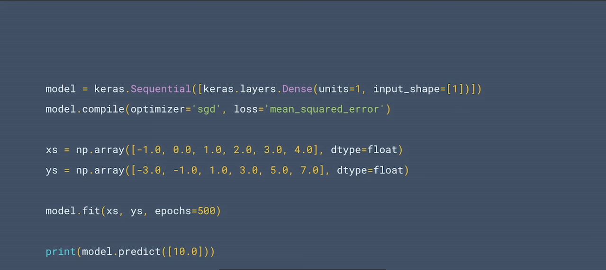
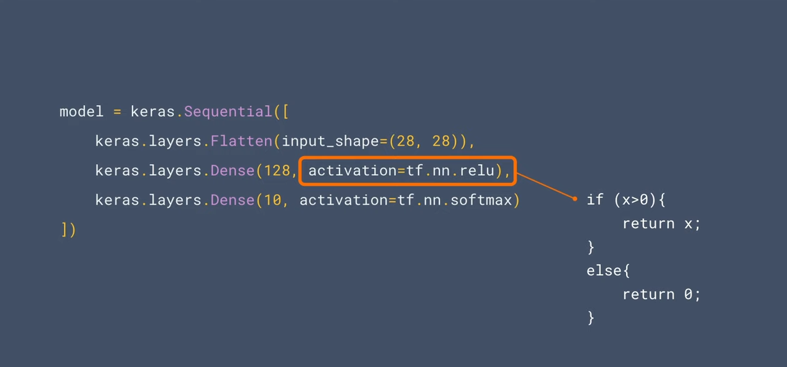
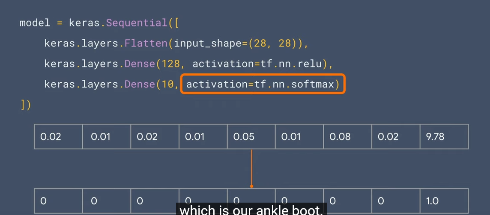

# sample of code & Links & images

## Useful Links: 

[Introducing convolutional neural networks (ML Zero to Hero - Part 3)](https://www.youtube.com/watch?v=x_VrgWTKkiM&list=PLQY2H8rRoyvwWuPiWnuTDBHe7I0fMSsfO&index=3&pp=iAQB)

### Images:

<table>
  <tr>
    <td>simpe 2x-1 function to model</td>
     <td>relu</td>
     <td>softmax</td>
  </tr>
  <tr>
    <td></td>
    <td></td>
    <td></td>
  </tr>
 </table>